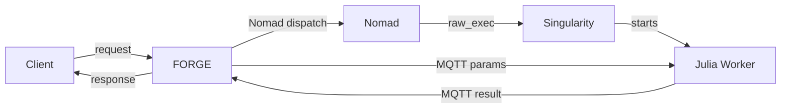
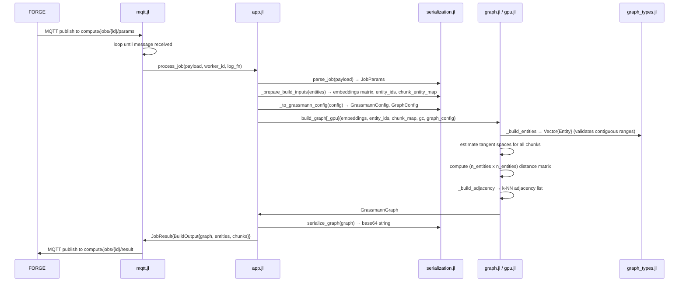

# Architecture

<!-- @tier: 1 -->
<!-- @see-also: docs/subsystems/, CONCEPTS.md -->

## Table of Contents

1. [System Overview](#1-system-overview)
2. [Component Inventory](#2-component-inventory)
3. [Data Flow](#3-data-flow)
4. [Type System](#4-type-system)
5. [GPU Acceleration](#5-gpu-acceleration)
6. [Container and Deployment](#6-container-and-deployment)
7. [Invariants](#7-invariants)
8. [Known Constraints](#8-known-constraints)

---

## 1. System Overview

The Grassmann Distance worker is a one-shot Julia GPU compute process dispatched by the FORGE orchestrator. It receives a single job over MQTT — either a `build` (construct a `GrassmannGraph` from raw embeddings) or a `query` (run a path or topology query against a previously-built graph) — executes it, publishes the result, and exits. No state is kept between dispatches. The graph itself is serialized as a base64-encoded Julia `Serialization` blob and passed through FORGE as an opaque string; the worker is the only consumer that needs to read it.

For the mathematical rationale behind Grassmann distance and the conceptual path model, see [CONCEPTS.md](CONCEPTS.md). This document covers structure, not theory.



MQTT topics per job (scoped by `job_id`):

| Topic | Direction | Purpose |
|---|---|---|
| `compute/jobs/{job_id}/params` | FORGE → worker | Job payload (subscribed, QoS 1) |
| `compute/jobs/{job_id}/result` | worker → FORGE | `JobResult` JSON (QoS 1) |
| `compute/jobs/{job_id}/status` | worker → FORGE | `processing` / `completed` / `error` (QoS 0) |
| `compute/jobs/{job_id}/logs` | worker → FORGE | Structured log lines (QoS 0) |

---

## 2. Component Inventory

| File | Role | Layer | Key dependencies |
|---|---|---|---|
| `src/GrassmannDistance.jl` | Module root; include order and exports | infrastructure | all src files |
| `src/types.jl` | `GrassmannConfig`, `TangentSpace`, `RankingEntry` | core geometry | — |
| `src/graph_types.jl` | `GraphConfig`, `Entity`, `GrassmannGraph`, `ConceptualPath`, `Community`, `Basin` | graph | `types.jl` |
| `src/job_types.jl` | FORGE contract types: all input/output JSON structs and `WorkerConfig` | FORGE contract | — |
| `src/config.jl` | `load_config()` — reads `WorkerConfig` from env | infrastructure | `job_types.jl` |
| `src/neighbors.jl` | `knn()` — brute-force k-nearest neighbors, CPU SIMD | core geometry | — |
| `src/tangent.jl` | `estimate_tangent_space()`, `estimate_tangent_spaces()` — local PCA via SVD | core geometry | `neighbors.jl`, `types.jl` |
| `src/distance.jl` | `principal_angles()`, `grassmann_distance()` — geodesic and chordal | core geometry | `types.jl` |
| `src/ranking.jl` | `rank_candidates()` — full pipeline from embeddings to sorted `RankingEntry` | pipeline | `neighbors.jl`, `tangent.jl`, `distance.jl` |
| `src/entity_distance.jl` | `entity_distance()` — chunk-averaged inter-entity Grassmann distance | graph | `distance.jl`, `graph_types.jl` |
| `src/graph.jl` | `build_graph()` — constructs `GrassmannGraph`; `_build_entities()`, `_build_adjacency()` | graph | `entity_distance.jl`, `tangent.jl` |
| `src/paths.jl` | `find_greedy_path()`, `find_shortest_path()`, `reachable()` | graph | `graph_types.jl` |
| `src/topology.jl` | `communities()`, `basins()`, `bridges()`, `hub_centrality()`, `hub_concentration()`, `bidirectional_edges()` | graph | `graph_types.jl` |
| `src/serialization.jl` | `parse_job()`, `serialize_result()`, `serialize_graph()`, `deserialize_graph()`; JSON3/StructTypes mappings | FORGE contract | `job_types.jl`, `graph_types.jl` |
| `src/app.jl` | `process_job()` — top-level dispatch; `_process_build()`, `_process_query()`, `_dispatch_query()` | FORGE contract | `serialization.jl`, `graph.jl`, `gpu.jl` |
| `src/gpu.jl` | `build_graph_gpu()`, `_gpu_all_knn()`, `_gpu_estimate_tangent_spaces()`, `_gpu_entity_distance_matrix()`, `select_backend()` | infrastructure | `graph.jl`, AMDGPU |
| `src/mqtt.jl` | `subscribe_and_process!()`, `julia_main()` — MQTT lifecycle and entry point | infrastructure | `app.jl`, `config.jl`, Mosquitto |

---

## 3. Data Flow

### Build job



### Query job

```mermaid
sequenceDiagram
    participant FORGE
    participant mqtt.jl
    participant app.jl
    participant serialization.jl
    participant paths.jl / topology.jl

    FORGE->>mqtt.jl: MQTT publish to compute/jobs/{id}/params
    mqtt.jl->>app.jl: process_job(payload, worker_id, log_fn)
    app.jl->>serialization.jl: parse_job(payload) → JobParams
    app.jl->>serialization.jl: deserialize_graph(qp.graph) → GrassmannGraph
    app.jl->>app.jl: _dispatch_query(graph, QuerySpec)
    alt greedy_path / shortest_path
        app.jl->>paths.jl: find_greedy_path() or find_shortest_path()
        paths.jl->>app.jl: ConceptualPath or nothing
    else reachable
        app.jl->>paths.jl: reachable(graph, from; max_hops)
        paths.jl->>app.jl: Vector{(id, hops, dist)}
    else communities / basins / topology
        app.jl->>topology.jl: communities(), basins(), bridges(), hub_centrality(), hub_concentration()
        topology.jl->>app.jl: topology structs
    end
    app.jl->>mqtt.jl: JobResult{QueryOutput}
    mqtt.jl->>FORGE: MQTT publish to compute/jobs/{id}/result
```

---

## 4. Type System

### Core geometry (src/types.jl)

| Type | Fields | Purpose |
|---|---|---|
| `GrassmannConfig` | `k::Int`, `p::Int`, `distance::Symbol` | Parameters for tangent space estimation (`k` neighbors, `p` principal components) and distance metric (`:geodesic` or `:chordal`) |
| `TangentSpace` | `basis::Matrix{Float64}` (ambient_dim, p), `center::Vector{Float64}` | Local p-dimensional subspace at a chunk: orthonormal basis columns + neighborhood centroid |
| `RankingEntry` | `id::String`, `distance::Float64` | Single result from `rank_candidates()` |

### Graph (src/graph_types.jl)

| Type | Fields | Purpose |
|---|---|---|
| `GraphConfig` | `k_graph::Int`, `max_chunks::Int` | k-NN graph density (default 3) and chunk sampling limit per entity (default 5) |
| `Entity` | `id::String`, `chunk_indices::UnitRange{Int}` | Named group of contiguous columns in the embedding matrix |
| `GrassmannGraph` | `entities`, `entity_index`, `embeddings`, `tangent_spaces`, `distance_matrix`, `neighbors`, `grassmann_config`, `graph_config` | Fully precomputed graph: the opaque blob returned by a build job |
| `ConceptualPath` | `nodes::Vector{String}`, `distances::Vector{Float64}`, `total_distance::Float64` | Ordered entity IDs and per-hop distances for a path result |
| `Community` | `members::Vector{String}`, `root::String` | Connected component of the bidirectional-edge subgraph |
| `Basin` | `attractor::String`, `members::Vector{String}` | Gravitational basin: entities whose greedy descent converges to the same attractor |

### FORGE contract (src/job_types.jl)

Input types are deserialized from MQTT JSON. Output types are serialized to MQTT JSON. All string-keyed; entity IDs pass through untouched.

| Type | Role |
|---|---|
| `EntityInput` | `{id, embeddings[]}` — one entity with its chunk embeddings |
| `GraphConfigInput` | `{k, p, k_graph, max_chunks, distance}` — wire format for both configs |
| `BuildParams` | `{entities[], config}` |
| `QuerySpec` | `{type, from?, to?, depth?}` — `type` is one of `greedy_path`, `shortest_path`, `reachable`, `communities`, `basins`, `topology` |
| `QueryParams` | `{graph, query}` — `graph` is the opaque base64 blob from a prior build result |
| `JobParams` | `{job_id, mode, build?, query?}` — top-level dispatch envelope |
| `BuildOutput` | `{graph, entities, chunks}` — base64 graph blob + counts |
| `QueryOutput` | `{path?, reachable?, topology?}` — at most one field populated |
| `JobResult` | `{job_id, success, error?, result?, worker_id, timestamp}` |
| `WorkerConfig` | Read from env at startup: `broker_url`, `job_id`, `worker_id`, `mqtt_username`, `mqtt_password`, `use_gpu` |

`StructTypes.omitempties` is registered for `JobResult`, `JobParams`, `QuerySpec`, and `QueryOutput` — absent optional fields are omitted from JSON output rather than serialized as `null`.

---

## 5. GPU Acceleration

GPU acceleration applies only during `build_graph_gpu()` (the build job path, when `USE_GPU=true` and `AMDGPU.functional()` returns true). Query jobs always run on CPU — they operate on the precomputed distance matrix and adjacency list, which require no matrix arithmetic.

### What runs where

| Stage | Where | Why |
|---|---|---|
| All-pairs kNN (`_gpu_all_knn`) | GPU | Single GEMM: `||xi - xj||² = ||xi||² + ||xj||² - 2·xi'xj`. One `(n,n)` matrix multiply covers all chunk pairs simultaneously. Sorting of rows happens on CPU — partial sort of full GPU rows is not worth the transfer overhead. |
| Tangent space estimation (`_gpu_estimate_tangent_spaces`) | Neighborhood gather and centering on GPU; SVD on CPU | Neighborhood gather (`d_emb[:, idx]`) and centering are GPU-native broadcasts. SVD falls back to CPU because rocSOLVER dispatch is unreliable (see section 8), and the matrices are small `(ambient_dim × k)` — CPU SVD is fast enough. |
| Entity distance cross-products (`_gpu_entity_distance_matrix`) | Batched dot products on GPU; SVD on CPU | All `U'V` cross-products for all entity pairs are stacked into `(dim, p*n_pairs)` matrices and computed as parallel element-wise multiply-and-reduce on GPU. The resulting `(p,p)` matrices are pulled to CPU for SVD to extract principal angles. |
| k-NN adjacency construction (`_build_adjacency`) | CPU | Operates on the `(n_entities, n_entities)` distance matrix, which is small relative to the chunk count. Not worth device transfer. |

### Backend selection

`select_backend(use_gpu::Bool)` in `src/gpu.jl` returns `AMDGPU.ROCBackend()` if `use_gpu=true` and `AMDGPU.functional()`, otherwise `CPU()`. The `CPU()` path routes to the standard `build_graph()` in `src/graph.jl`, which uses `@simd` inner loops and LAPACK-backed SVD via `LinearAlgebra.svd`.

Array transfer to device is handled by `_to_device(x, backend)`: no-op for `CPU()`, wraps in `AMDGPU.ROCArray` for `ROCBackend()`.

---

## 6. Container and Deployment

### Singularity image

`singularity.def` bootstraps from `julia:1.12.5` (Docker Hub via Harbor). The `%post` section:

1. Installs system dependencies including `libmosquitto-dev` and AMD GPU libraries (`libdrm-amdgpu1`, `libelf1`, `libnuma1`).
2. Runs `Pkg.instantiate()` and `Pkg.precompile()`.
3. Runs `test/runtests.jl` as a build-time validation step — a failing test aborts the image build.

The `%runscript` validates required env vars (`MQTT_BROKER`, `MQTT_USER`, `MQTT_PASSWORD`, `JOB_ID`), then launches:

```
julia --project=/app [--sysimage=<path>] -e 'using GrassmannDistance; exit(GrassmannDistance.julia_main())'
```

If a sysimage is present at `SYSIMAGE_PATH` (or the default `/app/sysimage.so`), it is passed to Julia with `--sysimage`. If absent, Julia JIT-compiles on startup (~30s cold start). The container ships without a sysimage — see section 8.

### Artifact path

Built images are written directly to the NFS share by the CI runner. The Nomad job reads the `.sif` from that NFS path without any HTTP download step — images are too large for Nomad's artifact stanza.

A `manifest.json` alongside the `.sif` records `git_commit` and `built_at` for traceability.

### CI (`.gitea/workflows/build.yml`)

Triggered on push to `main`. Runs on a self-hosted runner (`packer`) with Singularity on PATH and `/nfs/images` mounted. Steps:

1. `singularity build --fakeroot worker.sif singularity.def` — build scratch is forced to local disk (`/var/tmp`) because NFS xattrs break fakeroot unpacking.
2. Move `worker.sif` to the NFS destination and write `manifest.json`.
3. `nomad job run deploy/nomad/grassmann-distance.hcl` — register the (unchanged) job definition. `NOMAD_ADDR` is a Gitea repo variable.

### Nomad job

`deploy/nomad/grassmann-distance.hcl` defines a parameterized batch job. Key properties:

- `type = "batch"` — exits after one run; no rescheduling (`attempts = 0`).
- `meta_required = ["job_id"]` — each dispatch must supply a `job_id`; this becomes the MQTT topic suffix via `NOMAD_META_job_id`.
- Constrained to nodes with `meta.gpu = true` and `meta.rocm = true`.
- Driver: `raw_exec` running Singularity with `--writable-tmpfs` and `/opt/rocm` bound in.
- Credentials (`MQTT_BROKER`, `MQTT_USER`, `MQTT_PASSWORD`) are injected from Vault via the `forge` policy — not present in the job file.
- `WORKER_ID = "nomad-${NOMAD_ALLOC_ID}"` — unique per allocation, used as the MQTT client ID and stamped on `JobResult`.

---

## 7. Invariants

**Contiguous chunk ranges.** The `entity_ids` and `chunk_entity_map` passed to `build_graph` or `build_graph_gpu` must be ordered so each entity's chunks occupy a contiguous block of columns in the embedding matrix. `_build_entities()` enforces this with an explicit check and throws `ArgumentError` on violation. `Entity.chunk_indices` is a `UnitRange{Int}` into the shared `embeddings` column space.

**Graph is built once, queried many times.** `GrassmannGraph` is fully precomputed: all tangent spaces, the full `(n_entities, n_entities)` distance matrix, and the k-NN adjacency list. Build is expensive; all path and topology queries are cheap lookups into that structure.

**MQTT params captured before dispatch.** `subscribe_and_process!()` captures `config.job_id`, `config.worker_id`, the topic names, and the broker connection before invoking `process_job`. The result and status are published using the same client instance — there is no re-read of env vars after startup.

**One-shot batch execution.** The worker subscribes, receives exactly one message, processes it, publishes the result, disconnects, and exits. There is no retry loop, no multiple-job handling, and no idle state. Nomad's `restart.attempts = 0` and `reschedule.attempts = 0` enforce this at the scheduler level.

**Opaque graph blob.** The `GrassmannGraph` is serialized with Julia's `Serialization` module and base64-encoded. Clients treat it as opaque. The wire field name is `graph` in both `BuildOutput` (produced) and `QueryParams` (consumed). No consumer other than the Julia worker reads its contents.

**k ≤ n_entities - 1.** `build_graph` and `build_graph_gpu` both clamp `k_graph` to `min(graph_config.k_graph, n_entities - 1)` before calling `_build_adjacency`, preventing self-neighbor entries or over-request when entity count is small.

**Representative chunk sampling is deterministic.** `_representative_chunks` uses `round.(Int, range(1, n; length=max_chunks))` — same entity, same result on every call. Entity distance computation is reproducible.

---

## 8. Known Constraints

**Sysimage build fails on non-ROCm hosts.** PackageCompiler uses Julia's bundled LLVM to compile the sysimage. `AMDGPU.jl` injects AMD GCN bitcode (`amdgcn` intrinsics) into that pipeline. Julia's generic LLVM cannot handle GCN intrinsics and aborts with `LLVM ERROR: Broken module found`. This occurs even when `GrassmannDistance` itself is the only precompile target — `using GrassmannDistance` loads AMDGPU. Installing ROCm on the build host does not help because the crash is inside Julia's own LLVM, not the ROCm runtime. The workaround is to build the sysimage on the GPU node (where ROCm's LLVM is present) and place it on NFS for the container to pick up at runtime via `SYSIMAGE_PATH`. See `TODO.md` for the step-by-step procedure.

**`--writable-tmpfs` is required.** The Singularity container is launched with `--writable-tmpfs`. AMDGPU.jl and the Mosquitto wrapper require writable filesystem access during initialization (JIT artifact caching, native library unpacking). Without `--writable-tmpfs` the worker fails to start.

**rocSOLVER SVD dispatch is unreliable.** GPU SVD through AMDGPU's rocSOLVER backend produces incorrect results or panics on certain matrix shapes under the tested ROCm version. Tangent space SVD (`dim × k` matrices) and cross-product SVD (`p × p` matrices, where p ≤ 2) both fall back to CPU `LinearAlgebra.svd`. These matrices are small enough that CPU SVD has negligible cost.

**No incremental graph update.** Adding, removing, or modifying any entity requires a full rebuild — new tangent space neighborhoods can overlap entity boundaries, and the distance matrix is fully dense. FORGE must dispatch a new build job with the complete updated entity set.

---

## Related Documents

- [CONCEPTS.md](CONCEPTS.md) — mathematical rationale for Grassmann distance, principal angles, tangent spaces, and the graph topology model
- [TODO.md](TODO.md) — sysimage build procedure and open research questions
